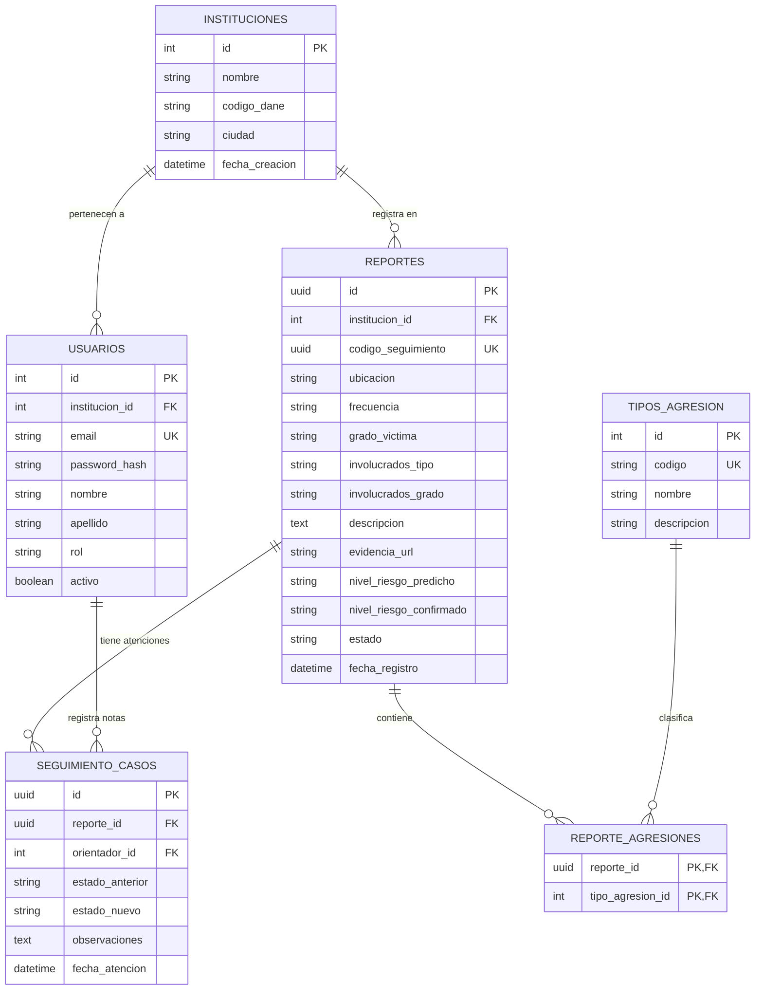

# Diseño de Base de Datos — SafeVoice

---

## 1. Principios de Arquitectura de Datos

1. **Anonimato Estructural Infalible:** La tabla `reportes` no contiene **ninguna clave foránea (`FK`)** hacia la tabla `usuarios`. Es físicamente imposible rastrear qué estudiante o persona creó un reporte a partir de la base de datos.
2. **Trazabilidad de Gestión (Auditoría):** Los orientadores y directivos pueden registrar bitácoras y acciones de seguimiento (`seguimiento_casos`), pero estas acciones solo están vinculadas al **código del reporte** y al **orientador que atendió**, nunca al denunciante.
3. **Normalización y Flexibilidad:** Relaciones normalizadas para tipos de agresión (relación M:N) para permitir estadísticas limpias y consultas rápidas en tableros e Inteligencia Artificial.

---

## 2. Diagrama Entidad-Relación (ERD)



---

## 3. Diccionario de Datos

### 🏢 Tabla: `instituciones`
Almacena los colegios o instituciones educativas inscritas en la plataforma.

| Campo | Tipo | Nulo | Descripción |
| :--- | :--- | :--- | :--- |
| `id` | `INT` (PK) | No | Identificador autoincremental de la institución. |
| `nombre` | `VARCHAR(150)` | No | Nombre oficial del colegio. |
| `codigo_dane` | `VARCHAR(20)` | Sí | Código DANE o NIT institucional. |
| `ciudad` | `VARCHAR(100)` | No | Ciudad o municipio (ej. Medellín). |
| `fecha_creacion` | `DATETIME` | No | Fecha de alta de la institución. |

---

### 👤 Tabla: `usuarios`
Usuarios administrativos con acceso al panel (Directivos y Orientadores).

| Campo | Tipo | Nulo | Descripción |
| :--- | :--- | :--- | :--- |
| `id` | `INT` (PK) | No | Identificador del usuario. |
| `institucion_id` | `INT` (FK) | No | Institución a la que pertenece el usuario. |
| `email` | `VARCHAR(150)` | No | Correo institucional (único, se usa para login). |
| `password_hash` | `VARCHAR(255)` | No | Hash seguro de la contraseña (Django Auth). |
| `nombre` | `VARCHAR(100)` | No | Nombre del usuario. |
| `apellido` | `VARCHAR(100)` | No | Apellido del usuario. |
| `rol` | `VARCHAR(20)` | No | Enum: `'DIRECTIVO'` o `'ORIENTADOR'`. |
| `activo` | `BOOLEAN` | No | Estado de la cuenta (`TRUE` / `FALSE`). |

---

### 📝 Tabla: `reportes`
Registros anónimos creados por estudiantes (Víctimas o Testigos).

| Campo | Tipo | Nulo | Descripción |
| :--- | :--- | :--- | :--- |
| `id` | `UUID` (PK) | No | Identificador único interno. |
| `institucion_id` | `INT` (FK) | No | Colegio donde ocurrió el hecho. |
| `codigo_seguimiento` | `UUID` | No | Clave pública anónima entregada al estudiante para consultar su estado. |
| `ubicacion` | `VARCHAR(50)` | No | Categoría: `SALON`, `PASILLOS`, `BANOS`, `DESCANSO`, `SALIDA`, `INTERNET`. |
| `frecuencia` | `VARCHAR(50)` | No | Categoría: `PRIMERA_VEZ`, `SEMANAS`, `MESES`. |
| `grado_victima` | `VARCHAR(20)` | Sí | Grado escolar opcional (ej. `"7°"`). |
| `involucrados_tipo` | `VARCHAR(20)` | Sí | `INDIVIDUAL`, `GRUPO`, `DESCONOCIDO`. |
| `involucrados_grado` | `VARCHAR(30)` | Sí | `MISMO_SALON`, `MISMO_GRADO`, `OTRO_GRADO`. |
| `descripcion` | `TEXT` | No | Narrativa libre (Insumo principal para el modelo de IA). |
| `evidencia_url` | `VARCHAR(255)` | Sí | Enlace o path a imagen/captura de pantalla. |
| `nivel_riesgo_predicho`| `VARCHAR(20)` | Sí | Resultado de IA NLP: `BAJO`, `MEDIO`, `ALTO`, `CRITICO`. |
| `nivel_riesgo_confirmado`| `VARCHAR(20)`| Sí | Nivel verificado manualmente por el orientador. |
| `estado` | `VARCHAR(20)` | No | Estado del ciclo de vida: `NUEVO`, `EN_REVISION`, `EN_SEGUIMIENTO`, `CERRADO`, `DESCARTADO`. |
| `fecha_registro` | `DATETIME` | No | Marca de tiempo automática. |

---

### 🏷️ Tabla: `tipos_agresion`
Catálogo técnico de clasificaciones de acoso escolar.

| Campo | Tipo | Nulo | Descripción |
| :--- | :--- | :--- | :--- |
| `id` | `INT` (PK) | No | ID del tipo de agresión. |
| `codigo` | `VARCHAR(30)` | No | Identificador técnico: `FISICO`, `VERBAL`, `PSICOLOGICO_SOCIAL`, `CIBERBULLYING`, `MATERIAL`. |
| `nombre` | `VARCHAR(100)` | No | Nombre legible (ej. "Acoso Verbal"). |
| `descripcion` | `TEXT` | Sí | Explicación detallada. |

---

### 🔗 Tabla Intermedia: `reporte_agresiones`
Relación M:N entre reportes y tipos de agresión (un reporte puede incluir múltiples formas de agresión).

| Campo | Tipo | Nulo | Descripción |
| :--- | :--- | :--- | :--- |
| `reporte_id` | `UUID` (PK, FK) | No | Referencia a `reportes.id`. |
| `tipo_agresion_id`| `INT` (PK, FK) | No | Referencia a `tipos_agresion.id`. |

---

### 📋 Tabla: `seguimiento_casos`
Bitácora de atención creada por el orientador para documentar entrevistas, compromisos o resolución.

| Campo | Tipo | Nulo | Descripción |
| :--- | :--- | :--- | :--- |
| `id` | `UUID` (PK) | No | ID de la nota de seguimiento. |
| `reporte_id` | `UUID` (FK) | No | Caso al que pertenece esta atención. |
| `orientador_id` | `INT` (FK) | No | Orientador que realizó la intervención. |
| `estado_anterior` | `VARCHAR(20)` | No | Estado previo del caso. |
| `estado_nuevo` | `VARCHAR(20)` | No | Nuevo estado asignado tras la sesión. |
| `observaciones` | `TEXT` | No | Notas confidenciales del orientador sobre las acciones tomadas. |
| `fecha_atencion` | `DATETIME` | No | Fecha y hora del seguimiento. |

---

## 4. Script DDL SQL (PostgreSQL / SQL Server)

```sql
-- Habilitar extensión para UUIDs (PostgreSQL)
CREATE EXTENSION IF NOT EXISTS "uuid-ossp";

-- 1. Tabla Instituciones
CREATE TABLE instituciones (
    id SERIAL PRIMARY KEY,
    nombre VARCHAR(150) NOT NULL,
    codigo_dane VARCHAR(20),
    ciudad VARCHAR(100) NOT NULL,
    fecha_creacion TIMESTAMP DEFAULT CURRENT_TIMESTAMP
);

-- 2. Tabla Usuarios
CREATE TABLE usuarios (
    id SERIAL PRIMARY KEY,
    institucion_id INT NOT NULL REFERENCES instituciones(id) ON DELETE CASCADE,
    email VARCHAR(150) UNIQUE NOT NULL,
    password_hash VARCHAR(255) NOT NULL,
    nombre VARCHAR(100) NOT NULL,
    apellido VARCHAR(100) NOT NULL,
    rol VARCHAR(20) NOT NULL CHECK (rol IN ('DIRECTIVO', 'ORIENTADOR')),
    activo BOOLEAN DEFAULT TRUE,
    fecha_creacion TIMESTAMP DEFAULT CURRENT_TIMESTAMP
);

-- 3. Tabla Catálogo Tipos de Agresión
CREATE TABLE tipos_agresion (
    id SERIAL PRIMARY KEY,
    codigo VARCHAR(30) UNIQUE NOT NULL,
    nombre VARCHAR(100) NOT NULL,
    descripcion TEXT
);

-- Insertar catálogo base
INSERT INTO tipos_agresion (codigo, nombre) VALUES
('FISICO', 'Acoso Físico'),
('VERBAL', 'Acoso Verbal'),
('PSICOLOGICO_SOCIAL', 'Acoso Psicológico o Exclusión Social'),
('CIBERBULLYING', 'Ciberacoso / Ciberbullying'),
('MATERIAL', 'Daño o Robo de Pertrenencias');

-- 4. Tabla Reportes (Totalmente anónima)
CREATE TABLE reportes (
    id UUID PRIMARY KEY DEFAULT uuid_generate_v4(),
    institucion_id INT NOT NULL REFERENCES instituciones(id) ON DELETE CASCADE,
    codigo_seguimiento UUID UNIQUE NOT NULL DEFAULT uuid_generate_v4(),
    ubicacion VARCHAR(50) NOT NULL,
    frecuencia VARCHAR(50) NOT NULL,
    grado_victima VARCHAR(20),
    involucrados_tipo VARCHAR(20),
    involucrados_grado VARCHAR(30),
    descripcion TEXT NOT NULL,
    evidencia_url VARCHAR(255),
    nivel_riesgo_predicho VARCHAR(20) CHECK (nivel_riesgo_predicho IN ('BAJO', 'MEDIO', 'ALTO', 'CRITICO')),
    nivel_riesgo_confirmado VARCHAR(20) CHECK (nivel_riesgo_confirmado IN ('BAJO', 'MEDIO', 'ALTO', 'CRITICO')),
    estado VARCHAR(20) DEFAULT 'NUEVO' CHECK (estado IN ('NUEVO', 'EN_REVISION', 'EN_SEGUIMIENTO', 'CERRADO', 'DESCARTADO')),
    fecha_registro TIMESTAMP DEFAULT CURRENT_TIMESTAMP
);

-- 5. Tabla Intermedia Reporte-Agresiones (M:N)
CREATE TABLE reporte_agresiones (
    reporte_id UUID NOT NULL REFERENCES reportes(id) ON DELETE CASCADE,
    tipo_agresion_id INT NOT NULL REFERENCES tipos_agresion(id) ON DELETE CASCADE,
    PRIMARY KEY (reporte_id, tipo_agresion_id)
);

-- 6. Tabla Bitácora de Seguimiento de Casos
CREATE TABLE seguimiento_casos (
    id UUID PRIMARY KEY DEFAULT uuid_generate_v4(),
    reporte_id UUID NOT NULL REFERENCES reportes(id) ON DELETE CASCADE,
    orientador_id INT NOT NULL REFERENCES usuarios(id),
    estado_anterior VARCHAR(20) NOT NULL,
    estado_nuevo VARCHAR(20) NOT NULL,
    observaciones TEXT NOT NULL,
    fecha_atencion TIMESTAMP DEFAULT CURRENT_TIMESTAMP
);
```
