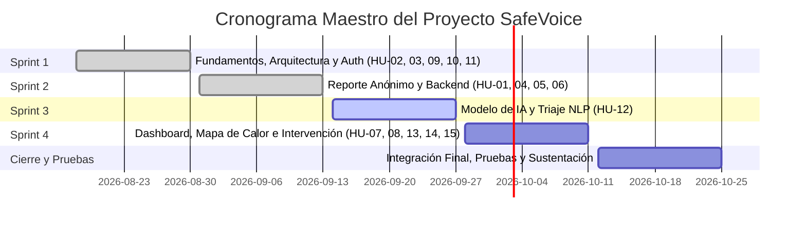
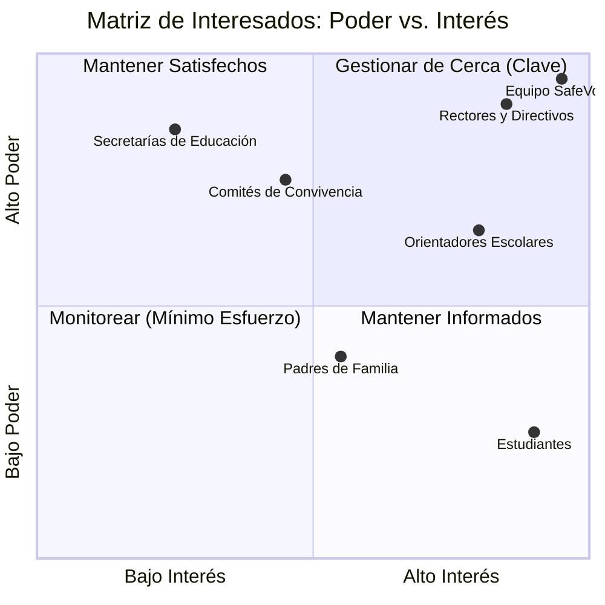

# SafeVoice — Documento de Entrega #2 (Versión Acumulativa 2.0)

**Asignatura / Proyecto:** Proyecto Integrador / Ingeniería de Software  
**Fecha de Entrega:** 20 de septiembre de 2026, 11:59 PM  
**Repositorio GitHub:** [https://github.com/MariArbe/SafeVoice](https://github.com/MariArbe/SafeVoice)  
**Rama Principal de Desarrollo:** `development`  

---

### Integrantes del Equipo y Roles

| Integrante | Rol en el Proyecto | Responsabilidades Principales |
|---|---|---|
| **Mariana Arbeláez** | Líder de Proyecto / Frontend & UI-UX Lead | Coordinación general, diseño y maquetación UI en Figma y React 19, componentes base, vistas de usuario y flujo de navegación. |
| **Esteban Álvarez** | Arquitecto de Software & Backend Developer | Arquitectura en Django REST Framework, base de datos SQL Server, autenticación JWT con roles, seguridad (Rate Limiting) y endpoints institucionales. |
| **Daniel López** | Ingeniero de Datos & Inteligencia Artificial | Diseño analítico del formulario de reporte (HU-01), criterios de clasificación de riesgo, pipeline de NLP para triaje automático y servicios de inferencia. |

---

## 📑 Tabla de Contenidos

1. [Capítulo 1: Fundamentación del Proyecto (Acumulativo Entregable #1)](#capítulo-1-fundamentación-del-proyecto)
   - 1.1 Introducción y Planteamiento de la Problemática
   - 1.2 Solución Propuesta (SafeVoice)
   - 1.3 Público Objetivo y Beneficios por Rol
   - 1.4 Análisis de Proceso: AS-IS vs. TO-BE
   - 1.5 Alcance y Limitaciones
   - 1.6 Impacto Organizacional Esperado
2. [Capítulo 2: Planeación General del Proyecto y Metodología](#capítulo-2-planeación-general-del-proyecto-y-metodología)
   - 2.1 Marco Metodológico (Scrum Adaptado)
   - 2.2 Cronograma Maestro por Sprints
   - 2.3 Roles y Acuerdos de Trabajo del Equipo
3. [Capítulo 3: Product Backlog y Trazabilidad de Historias de Usuario](#capítulo-3-product-backlog-y-trazabilidad-de-historias-de-usuario)
   - 3.1 Historias de Usuario (HU-01 a HU-15) y Criterios de Aceptación
   - 3.2 Asignación de Historias a Sprints
4. [Capítulo 4: Trazabilidad Técnica de Tareas, Responsables y Estados](#capítulo-4-trazabilidad-técnica-de-tareas-responsables-y-estados)
   - 4.1 Tablero Kanban y Trazabilidad en GitHub Projects
   - 4.2 Matriz Detallada de Tareas Técnicas (GitHub Issues)
5. [Capítulo 5: Evidencias de Avance a la Fecha (20 de Septiembre de 2026)](#capítulo-5-evidencias-de-avance-a-la-fecha)
   - 5.1 Entregables Técnicos Completados (Sprint 1 y Sprint 2)
   - 5.2 Módulo Frontend (React 19 + Tailwind CSS v4)
   - 5.3 Módulo Backend (Django + API REST + SQL Server)
   - 5.4 Formulario de Reporte y Modelo Analítico (HU-01)
6. [Capítulo 6: Artefactos Adicionales de Gestión (Bonificación +0.2)](#capítulo-6-artefactos-adicionales-de-gestión)
   - 6.1 Matriz de Interesados (Stakeholders Matrix - Poder vs. Interés)
   - 6.2 Matriz de Gestión de Riesgos del Proyecto (Probabilidad e Impacto)
7. [Capítulo 7: Referencias Bibliográficas (Normas APA 7.ª Edición)](#capítulo-7-referencias-bibliográficas)

---

## Capítulo 1: Fundamentación del Proyecto

### 1.1 Introducción y Planteamiento de la Problemática
En el entorno escolar colombiano y latinoamericano, la identificación y atención oportuna de situaciones de acoso escolar (bullying) y ciberacoso enfrentan una barrera crítica: **la cifra negra de no denuncia**. De acuerdo con cifras de la UNESCO (2019), uno de cada tres estudiantes en el mundo ha sido víctima de acoso por parte de sus compañeros.

En la actualidad, los canales institucionales disponibles (acudir verbalmente a la coordinación, hablar con el docente o utilizar buzones físicos) presentan severas deficiencias:
- **Ausencia de anonimato real:** El estudiante teme represalias de los agresores o estigmatización social ("ser tildado de delator/sapo").
- **Triaje y respuesta tardía:** Los orientadores escolares carecen de herramientas de priorización automática; un caso grave de violencia física o ideación suicida recibe el mismo tratamiento burocrático que un incidente verbal menor.
- **Falta de analítica institucional:** No existe consolidación de datos que permita a las directivas detectar puntos ciegos (lugares críticos como baños o descansos, cursos reincidentes o temporadas críticas).

### 1.2 Solución Propuesta (SafeVoice)
**SafeVoice** es una plataforma web inteligente y confidencial que democratiza la denuncia escolar y proporciona a directivos y orientadores herramientas predictivas de priorización.
- **Canal de reporte anónimo:** El estudiante registra incidentes mediante una interfaz empática, sin recopilación forzada de datos personales ni registro de direcciones IP.
- **Clasificación automatizada mediante Inteligencia Artificial (NLP):** Un modelo de procesamiento de lenguaje natural analiza la gravedad y el tipo de agresión (física, verbal, psicológica, ciberacoso), asignando un nivel de riesgo (Bajo, Medio, Alto, Crítico).
- **Consola de gestión institucional:** Bandeja de entrada para orientadores con indicadores visuales de urgencia y recomendaciones de intervención ajustadas al marco de la Ley 1620 de 2013 de Convivencia Escolar.
- **Tableros analíticos y mapas de calor:** Visualización geográfica y espacial de incidentes para prevención focalizada.

### 1.3 Público Objetivo y Beneficios por Rol
1. **Estudiantes (Víctimas y Testigos):** Canal seguro, accesible y libre de juicio para reportar incidentes en menos de 2 minutos.
2. **Orientadores Escolares:** Reducción del 80% en el tiempo de tabulación de reportes y detección temprana de casos críticos.
3. **Directivos y Comités de Convivencia:** Acceso a métricas en tiempo real para la toma de decisiones informadas y cumplimiento de protocolos legales.

### 1.4 Análisis de Proceso: AS-IS vs. TO-BE

| Etapa | Proceso Actual (AS-IS) | Proceso Propuesto SafeVoice (TO-BE) |
|---|---|---|
| **1. Incidente** | Ocurre la agresión en pasillo, aula o redes. | Ocurre la agresión. |
| **2. Decisión** | El estudiante calla por miedo a represalias. | El estudiante accede a SafeVoice desde cualquier dispositivo. |
| **3. Reporte** | Acercamiento verbal incómodo o buzón físico en desuso. | Formulario web confidencial; generación de ticket UUID de seguimiento. |
| **4. Triaje** | Espera pasiva de revisión humana sin priorización. | Clasificación instantánea de riesgo mediante modelo de IA. |
| **5. Atención** | Notificación lenta; intervención tardía. | Alerta inmediata en la bandeja del orientador según criticidad. |
| **6. Cierre** | Archivo físico sin trazabilidad ni analítica. | Bitácora digital de caso y actualización de estadísticas y mapa de calor. |

### 1.5 Alcance y Limitaciones
* **Incluye:** Aplicación web responsiva (frontend en React y backend en Django REST), base de datos relacional para auditoría de casos, módulo de IA para predicción de riesgo y analítica institucional.
* **Exclusiones:** No incluye integración nativa directa con software propietario de matrícula institucional ni apps nativas de tiendas móviles (se opta por diseño web responsivo).

---

## Capítulo 2: Planeación General del Proyecto y Metodología

### 2.1 Marco Metodológico (Scrum Adaptado)
El proyecto se desarrolla bajo el marco de trabajo **Scrum**, adaptado a un ciclo académico de **14 semanas de desarrollo estructurado en 4 Sprints quincenales**, con reuniones periódicas de sincronización (Daily standups semanales), planificación de Sprint y revisiones de entrega.

### 2.2 Cronograma Maestro por Sprints

| Sprint | Fechas | Enfoque Principal | Estado al 20-Sep-2026 |
|---|---|---|:---:|
| **Sprint 1** | Semanas 6 - 7 (18 Ago - 30 Ago) | Arquitectura base, diseño BD, autenticación JWT, registro institucional y vistas informativas. | **100% Completado** |
| **Sprint 2** | Semanas 8 - 9 (31 Ago - 13 Sep) | Formulario de reporte anónimo (HU-01), proxies de seguridad, tickets de seguimiento y backend de reportes. | **100% Completado** |
| **Sprint 3** | Semanas 10 - 11 (14 Sep - 27 Sep) | Entrenamiento/selección de modelo de IA (NLP), servicio de inferencia de riesgo y visualización de criticidad. | **En Progreso (Avance según plan)** |
| **Sprint 4** | Semanas 12 - 13 (28 Sep - 11 Oct) | Panel administrativo (Dashboard), mapa de calor geográfico, analítica y recomendaciones automáticas. | **Planeado** |
| **Cierre** | Semana 14 (12 Oct - 25 Oct) | Testing de integración extremo a extremo, hardening de seguridad y sustentación final. | **Planeado** |

---

## Capítulo 3: Product Backlog y Trazabilidad de Historias de Usuario

| ID | Historia de Usuario | Descripción Resumida | Sprint Asignado |
|:---:|---|---|:---:|
| **HU-01** | Reporte anónimo | El estudiante diligencia el formulario web de forma confidencial para reportar una agresión. | **Sprint 2** |
| **HU-02** | Información sobre bullying | El estudiante consulta qué es el acoso y cómo identificarlo en la sección informativa. | **Sprint 1** |
| **HU-03** | Recursos y líneas de ayuda | El estudiante accede a contactos de emergencia psicológica y líneas directas de atención. | **Sprint 1** |
| **HU-04** | Confirmación y ticket | El estudiante recibe confirmación inmediata y un código UUID único para seguimiento. | **Sprint 2** |
| **HU-05** | Protección del anonimato | Descarte de IPs, auditoría de logs y proxy de anonimización para asegurar el no rastreo. | **Sprint 2** |
| **HU-06** | Recepción de reportes | El orientador visualiza los reportes entrantes en su bandeja institucional. | **Sprint 2** |
| **HU-07** | Consulta y detalle de reportes | El orientador analiza el caso en detalle sin comprometer datos personales. | **Sprint 4** |
| **HU-08** | Actualización de estados | El orientador actualiza el ciclo de vida del caso (Nuevo, En Proceso, Atendido, Cerrado). | **Sprint 4** |
| **HU-09** | Acceso de orientadores | Inicio de sesión seguro con JWT y validación estricta de permisos institucionales. | **Sprint 1** |
| **HU-10** | Acceso de directivos | Autenticación y control de acceso diferenciado a tableros ejecutivos. | **Sprint 1** |
| **HU-11** | Registro de instituciones | Creación y enrolamiento de colegios junto con su usuario directivo administrador. | **Sprint 1** |
| **HU-12** | Clasificación de riesgo (IA) | Algoritmo predictivo de NLP que evalúa la descripción textual del reporte y estima su nivel de riesgo. | **Sprint 3** |
| **HU-13** | Estadísticas y métricas | Gráficas consolidadas de tendencias temporales y tipologías de agresión. | **Sprint 4** |
| **HU-14** | Mapa de calor escolar | Representación visual interactiva de zonas críticas del colegio (baños, aulas, patios). | **Sprint 4** |
| **HU-15** | Sugerencias de intervención | Recomendaciones automáticas guiadas por IA para orientar la acción psicológica y pedagógica. | **Sprint 4** |

---

## Capítulo 4: Trazabilidad Técnica de Tareas, Responsables y Estados

Las actividades del equipo se gestionan a través de **GitHub Projects** y el sistema de **Issues y Milestones** del repositorio `MariArbe/SafeVoice`.

### 4.1 Estado del Tablero de Tareas (Extracción Oficial de GitHub)

| Issue # | Tarea Técnica / Título | Historia Asociada | Sprint | Responsable Asignado | Estado Actual |
|:---:|---|:---:|:---:|:---:|:---:|
| `#35` | Endpoint `POST /instituciones` | HU-11 | Sprint 1 | Esteban Álvarez (`@EstebanchoAV`) | **Cerrada (Done)** |
| `#38` | Diseño de formulario de registro institucional | HU-11 | Sprint 1 | Mariana Arbeláez (`@MariArbe`) | **Cerrada (Done)** |
| `#40` | Validación de datos institucionales y DANE | HU-11 | Sprint 1 | Esteban Álvarez (`@EstebanchoAV`) | **Cerrada (Done)** |
| `#49` | Endpoint `POST /auth/login` y JWT | HU-09 / HU-10 | Sprint 1 | Esteban Álvarez (`@EstebanchoAV`) | **Cerrada (Done)** |
| `#50` | Manejo de sesión y tokens JWT enriquecidos | HU-09 / HU-10 | Sprint 1 | Esteban Álvarez (`@EstebanchoAV`) | **Cerrada (Done)** |
| `#52` | Diseño de interfaz de login docente | HU-09 | Sprint 1 | Mariana Arbeláez (`@MariArbe`) | **Cerrada (Done)** |
| `#54` | Validación de rol orientador en middleware | HU-09 | Sprint 1 | Esteban Álvarez (`@EstebanchoAV`) | **Cerrada (Done)** |
| `#20` | Maquetación de sección informativa | HU-02 | Sprint 1 | Mariana Arbeláez (`@MariArbe`) | **Cerrada (Done)** |
| `#21` | Maquetación de vista de contactos y recursos | HU-03 | Sprint 1 | Mariana Arbeláez (`@MariArbe`) | **Cerrada (Done)** |
| `#15` | Diseño y especificación del formulario de reporte | HU-01 | Sprint 2 | Daniel López (`@dani1309`) | **Cerrada (Done)** |
| `#18` | Modelo de datos de reportes en base de datos | HU-01 | Sprint 2 | Esteban Álvarez (`@EstebanchoAV`) | **Cerrada (Done)** |
| `#24` | Diseño de pantalla/modal de confirmación | HU-04 | Sprint 2 | Mariana Arbeláez (`@MariArbe`) | **Cerrada (Done)** |
| `#34` | Diseño de bandeja de reportes de orientación | HU-06 | Sprint 2 | Mariana Arbeláez (`@MariArbe`) | **Cerrada (Done)** |
| `#62` | Implementación de patrón Proxy de anonimización | HU-05 | Sprint 2 | Esteban Álvarez (`@EstebanchoAV`) | **Cerrada (Done)** |
| `#16` | Maquetación y validación de campos del formulario | HU-01 | Sprint 2 | Mariana / Daniel | **Cerrada (Done en código)** |
| `#43` | Definición de niveles y criterios de riesgo | HU-12 | Sprint 3 | Daniel López (`@dani1309`) | **Cerrada (Done)** |
| `#44` | Entrenamiento/selección de modelo de texto NLP | HU-12 | Sprint 3 | Daniel López (`@dani1309`) | **En Progreso (In Progress)** |
| `#46` | Servicio de inferencia sobre el reporte | HU-12 | Sprint 3 | Daniel López (`@dani1309`) | **En Progreso (In Progress)** |
| `#12` | HU-12 - Clasificación de riesgo de reportes | HU-12 | Sprint 3 | Daniel López (`@dani1309`) | **En Progreso (In Progress)** |
| `#48` | Visualización de nivel de riesgo en bandeja | HU-12 | Sprint 3 | Mariana Arbeláez (`@MariArbe`) | **To Do (Sprint 3)** |
| `#51` | Endpoint `GET /estadisticas` | HU-13 | Sprint 4 | Daniel López (`@dani1309`) | **Planeado (Sprint 4)** |
| `#14` | HU-14 - Mapa de calor geográfico | HU-14 | Sprint 4 | Daniel López (`@dani1309`) | **Planeado (Sprint 4)** |
| `#60` | HU-15 - Sugerencias de intervención | HU-15 | Sprint 4 | Daniel López (`@dani1309`) | **Planeado (Sprint 4)** |

---

## Capítulo 5: Evidencias de Avance a la Fecha (20 de Septiembre de 2026)

Conforme a la planeación comprometida, al corte del **20 de septiembre de 2026** se cuenta con el **Sprint 1 y Sprint 2 culminados al 100%**, e inicio formal del **Sprint 3 (Modelo de IA)**.

### 5.1 Evidencias en Repositorio GitHub
- **Repositorio:** [https://github.com/MariArbe/SafeVoice](https://github.com/MariArbe/SafeVoice)
- **Ramas activas:** `main` (producción/versiones estables) y `development` (integración continua del equipo).
- **Commits auditables:**
  - `60e136f`: Maquetación integral del formulario de reporte (HU-01) con campos complementarios en React y documentación analítica.
  - `6234c96`: Implementación frontend de SeccionInformativa, ContactosRecursos y LineasAyuda.
  - `014fb46`: Librería de componentes reutilizables base (`Header`, `Footer`, `Boton`, `Campo`).
  - `df7490b`: Creación de la app `institutions`, sistema de throttling de seguridad (Rate Limiting) y pruebas automáticas.
  - `321c34b` y `72c349b`: Configuración de base de datos relacional y orquestación con Docker.

### 5.2 Módulo Frontend (React 19 + Tailwind CSS v4 + Vite)
- Estructura modular en [`frontend/src/`](file:///c:/Users/danie/.gemini/antigravity/scratch/SafeVoice/frontend/src/):
  - **Páginas públicas:** `Inicio.jsx`, `SeccionInformativa.jsx`, `ContactosRecursos.jsx`, `LineasAyuda.jsx` y `Reporte.jsx`.
  - **Formulario de Reporte (`Reporte.jsx`):** Flujo completo de 8 secciones (Institución, Perspectiva Víctima/Testigo, Grado Escolar, Ubicación, Frecuencia, Tipos de Agresión, Descripción Abierta e Insumo de Evidencia), con casilla condicional interactiva para revelación voluntaria de identidad en casos críticos.

### 5.3 Módulo Backend y Seguridad (Django REST Framework)
- **Anonimato Estructural:** Modelo [`Reporte`](file:///c:/Users/danie/.gemini/antigravity/scratch/SafeVoice/backend/apps/reports/models.py) desacoplado de usuarios y reforzado con el patrón Proxy en [`repository.py`](file:///c:/Users/danie/.gemini/antigravity/scratch/SafeVoice/backend/apps/reports/repository.py) para impedir la persistencia de IPs o cabeceras identificables.
- **Protección contra Fuerza Bruta:** Throttling configurado en `settings/base.py` (`anon`: 60 req/min, `login`: 10 req/min, `registro`: 5 req/min).
- **Pruebas Automatizadas:** Suite completa con `pytest` y fixtures en `conftest.py` con ejecución en SQLite en memoria para integración continua.

---

## Capítulo 6: Artefactos Adicionales de Gestión (Bonificación +0.2)

### 6.1 Matriz de Interesados del Proyecto (Stakeholders Matrix)

La identificación y análisis de interesados se fundamenta en el modelo de **Poder vs. Interés** de Mendelow, asegurando una gestión proactiva de expectativas:

| Interesado / Actor | Rol en el Proyecto | Nivel de Poder | Nivel de Interés | Estrategia de Gestión | Expectativas Clave |
|---|---|:---:|:---:|:---:|---|
| **Estudiantes (Víctimas / Testigos)** | Usuarios finales primarios | Bajo | Alto | **Mantener Informados y Proteger** | Garantía total de anonimato, facilidad de uso y ausencia de represalias. |
| **Orientadores Escolares / Psicología** | Operadores del sistema y gestores de caso | Medio | Alto | **Gestionar de Cerca (Colaboración activa)** | Alertas tempranas priorizadas, reducción de burocracia y apoyo en decisiones. |
| **Rectores y Directivos Docentes** | Clientes institucionales y decisores | Alto | Alto | **Gestionar de Cerca (Clave del éxito)** | Cumplimiento estricto de la Ley 1620 de 2013, reportes consolidados y estadísticas. |
| **Comités Escolares de Convivencia** | Órgano colegiado de resolución | Alto | Medio | **Mantener Satisfechos** | Trazabilidad documental de las acciones de seguimiento ante auditorías. |
| **Padres de Familia y Acudientes** | Beneficiarios indirectos | Medio | Medio | **Monitorear y Comunicar** | Entorno escolar seguro, protocolos claros de protección y confianza institucional. |
| **Ministerio / Secretarías de Educación** | Entidad regulatoria | Alto | Bajo | **Monitorear y Cumplir** | Alineación con estándares de protección de datos de menores (Habeas Data). |
| **Equipo de Desarrollo SafeVoice** | Ejecutores del producto | Alto | Alto | **Liderazgo y Autonomía** | Calidad de código, estabilidad técnica y entrega oportuna por sprints. |

---

### 6.2 Matriz de Gestión de Riesgos del Proyecto

La gestión de riesgos sigue los lineamientos del estándar ISO 31000 y la metodología cualitativa de probabilidad e impacto (escala 1 a 5):

| ID | Riesgo Identificado | Categoría | Prob. (1-5) | Imp. (1-5) | Severidad (PxI) | Estrategia | Plan de Mitigación y Contingencia |
|:---:|---|:---:|:---:|:---:|:---:|:---:|---|
| **R01** | **Filtración o rastreo involuntario de identidad de estudiantes** | Seguridad / Legal | 1 | 5 | **5 (Media-Alta)** | Evitar | Arquitectura sin claves foráneas a usuarios en la tabla `reportes`, descarte de cabeceras IP en proxy e inspección de logs. |
| **R02** | **Envío masivo de reportes falsos (Spam / Troll)** | Operativo / Calidad | 4 | 3 | **12 (Alta)** | Mitigar | Implementación de Rate Limiting por IP anónima (60 req/min), validación de coherencia semántica con IA y longitud mínima de relato. |
| **R03** | **Sesgo o imprecisión en el modelo de IA para clasificar riesgo** | Técnico / IA | 3 | 4 | **12 (Alta)** | Mitigar | Uso del modelo de IA como sugerencia de triaje; el orientador siempre tiene la última palabra para confirmar o reclasificar el riesgo. |
| **R04** | **Baja adopción estudiantil por desconfianza en la plataforma** | Organizacional | 3 | 5 | **15 (Crítica)** | Mitigar | Campañas pedagógicas de sensibilización, mensajes explícitos de confidencialidad en UI y pruebas de usabilidad guiadas. |
| **R05** | **Retraso en la integración entre Frontend (React) y Backend (Django)** | Gestión / Cronograma | 2 | 4 | **8 (Media)** | Mitigar | Definición temprana y estricta de contratos de API REST (Swagger/JSON schemas) y uso de stubs/mocks durante el desarrollo. |
| **R06** | **Fallas de disponibilidad del servidor de base de datos** | Infraestructura | 2 | 4 | **8 (Media)** | Transferir / Mitigar | Configuración de contenedores Docker con reinicio automático y respaldos periódicos programados del esquema relacional. |

---

## Capítulo 7: Referencias Bibliográficas (Normas APA 7.ª Edición)

* Congreso de la República de Colombia. (2013, 15 de marzo). *Ley 1620 de 2013: Por la cual se crea el Sistema Nacional de Convivencia Escolar y Formación para el Ejercicio de los Derechos Humanos, la Educación para la Sexualidad y la Prevención y Mitigación de la Violencia Escolar*. Diario Oficial No. 48.733.
* Ministerio de Educación Nacional de Colombia. (2014). *Guías pedagógicas para la convivencia escolar: Ley 1620 de 2013 y Decreto 1965 de 2013*. MEN.
* Project Management Institute. (2021). *A guide to the project management body of knowledge (PMBOK guide)* (7.ª ed.). Project Management Institute.
* Schwaber, K., & Sutherland, J. (2020). *La Guía de Scrum: Las Reglas del Juego*. Scrum.org. https://scrumguides.org/
* UNESCO. (2019). *Behind the numbers: Ending school violence and bullying*. United Nations Educational, Scientific and Cultural Organization. https://unesdoc.unesco.org/ark:/48223/pf0000366483
